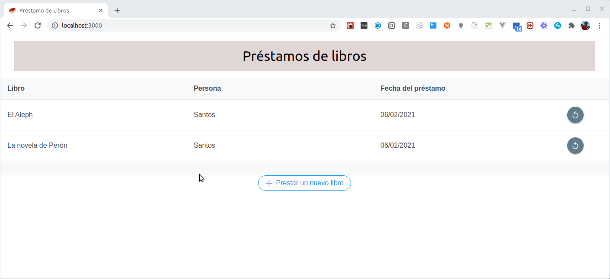

# Préstamo de libros (frontend React)

Esta aplicación sirve para mostrar la integración de un frontend contra una API que puede estar hecha en cualquier tecnología.

## Objetivo

Permitir que una institución gestione los préstamos de libros, por eso los casos de uso que necesitamos son:

- Generar un préstamo
- Devolver un libro, visualizando los préstamos pendientes de las personas

## Apunte

- [Apunte con la explicación completa del modelado](https://docs.google.com/document/d/1kLAsruPYKZBNB0zi40_ORYavt_daQzEpaz2tf6pB6zw/edit?usp=sharing)
## Interacción con el backend

### Página préstamos pendientes

TODO

### Página nuevo préstamo

TODO

